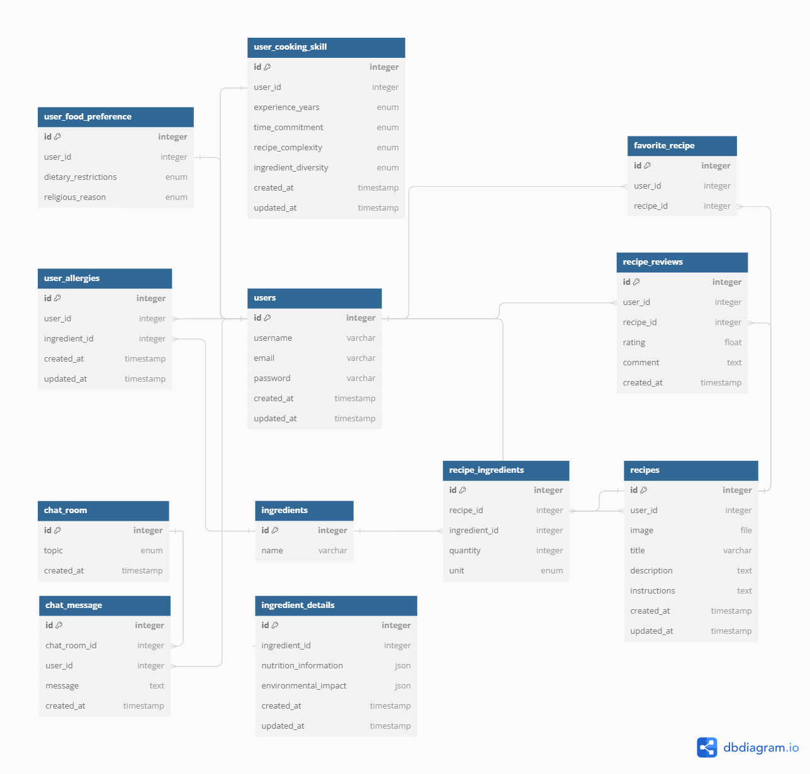

# Chefbot - Food Recipe Recommender Systems

## About Project
***ChefBot*** adalah food recipe recommender system API yang membantu User menemukan resep yang sempurna sesuai dengan preferensi, kebutuhan diet, dan keterampilan memasak mereka. ChefBot memanfaatkan teknologi integrasi API eksternal (OpenAI API & Spoonacular API) untuk memberikan rekomendasi yang dipersonalisasi dan akurat.

Dengan ChefBot, User dapat mencari resep yang mereka inginkan  (lengkap dengan informasi detailnya), membuat dan membagikan resep mereka sendiri, dan menerima rekomendasi resep yang disesuaikan dengan profil mereka.

## Features
### User
- User dapat register dan login ke sistem 
- User dapat melihat dan mengedit profile mereka, termasuk menambah informasi detail terkait keterampilan memasak (experience years, time_commitment, recipe complexity, ingredient diversity), preferensi makanan (e.g dietary restriction, religous reason), maupun alergi (terhadap suatu ingredients)
- User dapat mencari resep berdasarkan nama makanan (autocomplete search - integrasi Spoonacular API)
- User dapat melihat informasi detail terkait resep (waktu memasak, bahan-bahan + jumlah, healthscore, pantangan diet, instruksi memasak, sustainable / tidak)
- User dapat membuat, mengedit, dan menghapus resep mereka sendiri (upload image - integrasi Cloudinary
- User dapat memberikan rating dan review untuk resep.
- User dapat menandai resep sebagai favorit dan melihat daftar resep favorit mereka.
- User dapat menerima rekomendasi resep berdasarkan preferensi diet, keterampilan memasak, alergi dan resep yang mereka masukkan kedalam “favorite”.
- User dapat berpartisipasi dalam chat atau forum diskusi untuk berbagi tips memasak dan resep. (integrasi Websocket) 🚧

## Tech Stacks
- [Golang](https://go.dev/)
- [Echo](https://echo.labstack.com/)
- [Gorm](https://gorm.io/index.html)
- [JWT](https://jwt.io/)
- [Cron](https://pkg.go.dev/github.com/robfig/cron)
- [OpenAI](https://openai.com/)
- [Mockery](https://github.com/vektra/mockery)
- [Testify](https://github.com/stretchr/testify)
- [PostgreSQL](https://www.postgresql.org/)
- [Docker](https://www.docker.com/)
- [AWS EC2](https://aws.amazon.com/ec2/)
- [AWS RDS](https://aws.amazon.com/rds/)
- [GitHub Action](https://docs.github.com/actions)

## API Documentation
[Go Chefbot API](https://documenter.getpostman.com/view/29412671/2sA3JRZKRa)

## ERD


## Setup 

### Getting Started
1. Clone or fork this repository to your local computer.
    ```bash
      git clone https://github.com/satryanararya/go-food-recipe-recommender-systems.git
    ```
2. Navigate to project directory.
    ```bash
      cd go-food-recipe-recommender-systems
    ```
3. Copy example environment variable to .env file.
    ```bash
      cp .env.example .env
    ```
3. Install the dependencies
    ```bash
      go mod tidy
    ```
4. Run the application
    ```bash
      go run main.go
    ```